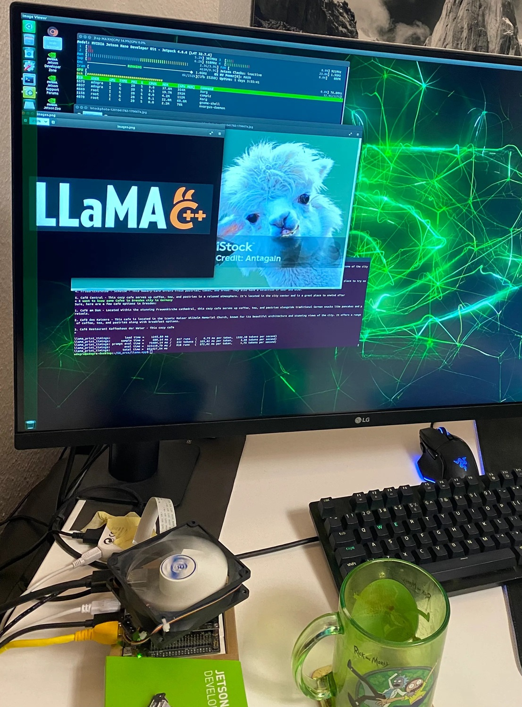
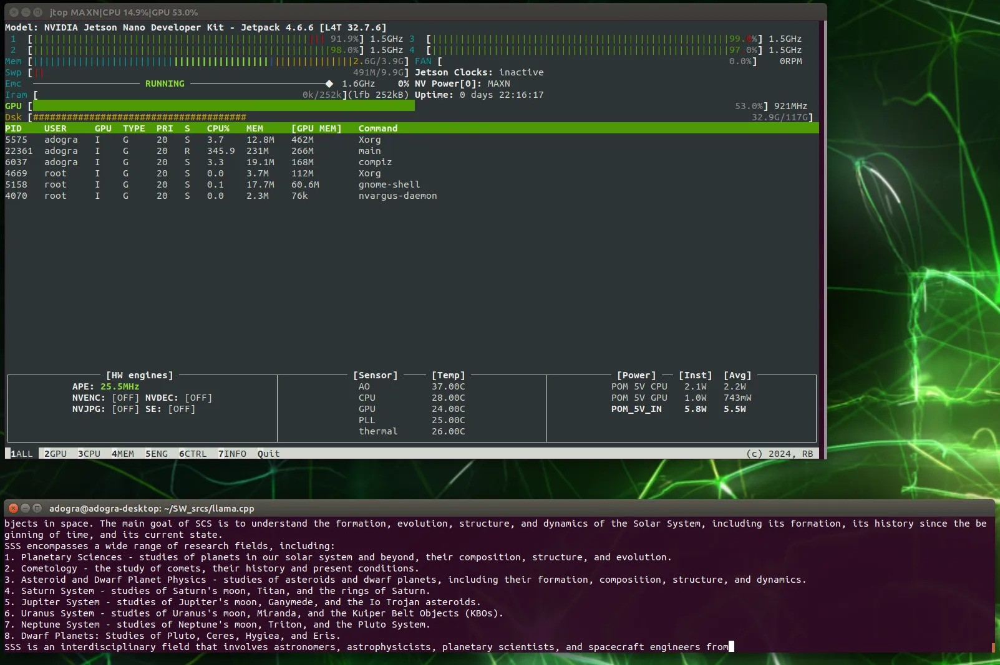
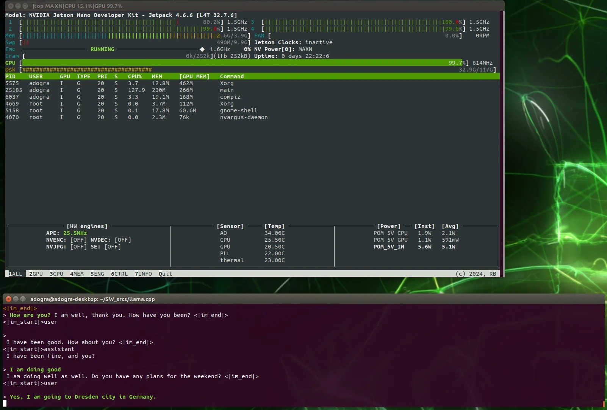
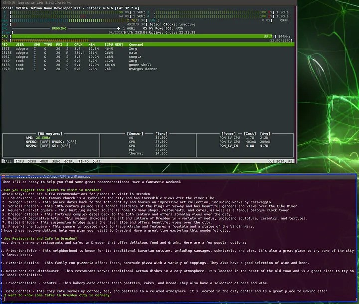
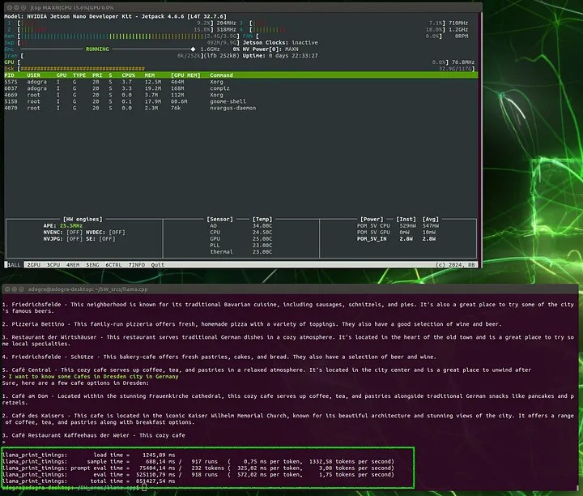
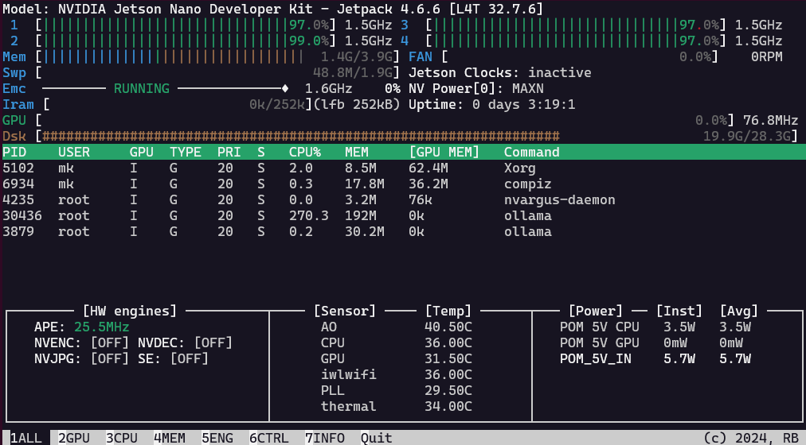

# Accelerate llama.cpp with the GPU and CUDA

With the Maxwell cores of the Jetson and supporting CUDA Compute Capability one would assume that llama.cpp and ollama would run accelerated. But that's not the case


## Limitations in Hardware and Software

|          | Jetson Nano | ollama CUDA | Jetson Orin Nano | Jetson Orin Nano | llama.cpp CUDA |
|----------|:-----------:|:-----------:|:----------------:|:----------------:|:--------------:|
| JetPack  |    4.6.6    |             |       5.1.4      |        6.2       |                |
| nvcc     |     10.2    |             |      11.4.19     |       12.6       |                |
| gcc      |     <= 8    |    >= 11    |        9.3       |       11.3       |                |
| L4T      |   r32.7.6   |             |      r35.6.0     |      r36.4.3     |                |
| kernel   |   4.9.337   |             |     5.10 LTS     |     5.15 LTS     |                |
| Ubuntu   |    18.04    |             |       20.04      |       22.04      |                |
| TensorRT |             |             |                  |       10.3       |                |
| cuDNN    |             |             |       8.6.0      |        9.3       |                |

## Thread on Gist

The original context can be found at https://gist.github.com/FlorSanders/2cf043f7161f52aa4b18fb3a1ab6022f

### 2025-01-28

This gist is from April 11, 2024 and refers to the old Jetson Nano from 2019 with only 2GB RAM. There was also a 4GB version, but all of the original Jetson Nano are only supported up to  [JetPack 4.6.6](https://developer.nvidia.com/jetpack-sdk-466) which includes CUDA 10.2 as latest version. Then this gist recommendes a version of llama.cpp to check out [a33e6a0](https://github.com/ggerganov/llama.cpp/commit/a33e6a0d2a66104ea9a906bdbf8a94d050189d91) from February 26, 2024. A lot has changed since then, and I think the Jetson Nano is natively supported by llama.cpp. The current version of the Makefile has entries for the Jetson [in line 476](https://github.com/ggerganov/llama.cpp/blob/2e2f8f093cd4fb6bbb87ba84f6b9684fa082f3fa/Makefile#L476). It could well be that this only refers to run on the CPU (as with the mentioned Raspberry Pi's) and not using the GPU with CUDA. This aligns with the [error message by VViliams123](https://gist.github.com/FlorSanders/2cf043f7161f52aa4b18fb3a1ab6022f?permalink_comment_id=5219170#gistcomment-5219170) on October 4, 2024.

Currently I can run ollama (based on llama.cpp) on my Jetson Nano 4GB from 2019 in **CPU** inference out of the box. I just followed the recommended installation. As pointed out in [ollama issue 4140](https://github.com/ollama/ollama/issues/4140) it should **not be possible** to run ollama with **CUDA** support on the **GPU** of the Jetson Nano. The reason being is that the latest JetPack from Nvidia only includes CUDA 10.2. The latest version of gcc that supports CUDA 10.2 is gcc-8. But to compile ollama with CUDA support you need at least gcc-11. @dtischler pointed out on May4, 2024 that the upgrade to gcc-11 can be done relatively easily, but CUDA and the GPU are not usable.

The situation is different for the **Jetson Orin Nano** you might refer to with 8GB of RAM. The Jetson Orin Nano is supported by [JetPack 5](https://developer.nvidia.com/embedded/jetpack-sdk-514) (L4T r35.x) and [JetPack 6](https://developer.nvidia.com/embedded/jetpack-sdk-62) (L4T r36.x) since 5.1.1. Inference acceleration using CUDA and the GPU should be possible, and probably work out of the box.

### 2025-02-09

Not sure if it would actually improve the inference speed, since the token generation is generally limited by memory speed. With the 4GB unified memory for CPU and GPU the [theoretical 25.6 GB/s](https://www.techpowerup.com/gpu-specs/jetson-nano.c3643) sets the maximum speed. I actually only get 6.8 GB/s in real world measurement with `sysbench memory --memory-block-size=1M run`, not sure why that is. 

The Jetsons Nano Orin with LPDDR5 has more and 3x faster memory with [theoretical 68.3 GB/s](https://www.techpowerup.com/gpu-specs/jetson-orin-nano-8-gb.c4082). And ongoing software support by Nvidia ...

### 2025-03-24 [Anurag Dogra](https://gist.github.com/anuragdogra2192)

I made it work on Ubuntu 18, Jetson Nano 4 GB with CUDA 10.2. with gcc 8.5
This version [81bc](https://github.com/ggml-org/llama.cpp/tree/81bc9214a389362010f7a57f4cbc30e5f83a2d28),
by defining the below before including <cuda_runtime.h> in `ggml-cuda.cu`

```
#if CUDA_VERSION < 11000
#define CUBLAS_TF32_TENSOR_OP_MATH CUBLAS_TENSOR_OP_MATH
#define CUBLAS_COMPUTE_16F CUDA_R_16F
#define CUBLAS_COMPUTE_32F CUDA_R_32F
#endif
```

make sure while `cmake -DLLAMA_CUBLAS=ON`

### 2025-03-24

Do you see your GPU being used in `jtop` or after running ollama with `ollama ps`? How does the inferrence speed compares to the pure use of the CPU? I got some 2.65 token/s with deepseek-r1:1.5b in ollama 0.5.4 with a surprizing 66% GPU utilization, but in `jtop` the GPU always idles. So not sure if the percentage from ollama is correct.

After upgrading to ollama 0.6.2 it goes even up to 100% GPU in `ollama ps` (using 1.9 GByte RAM), and the token generation is slightly faster with 3.66 token/s. But `jtop` indicates 0% GPU usage, while the CPU is at 100%. Only sometimes some GPU activity is showing, but thats probably related to screen activity (headless is always 0%).

Switching ollama to pure CPU with `/set parameter num_gpu 0` does not change the 3.66 token/s speed. But `ollama ps` reports now 100% CPU and needs only 1.1 GByte RAM. As usual it takes a few seconds to unload the model from the GPU and reload the model to the RAM for the CPU (even in this unified architecture, I guess the memory controller handles the different usage case for CPU). The increased RAM usage in ollama for the same model when using a GPU (compared to the CPU) matches my experience with larger GPUs and models (like P106-100 or 3060 Ti). The unchanged token generation speed matches my experience with their linear corellation of token/s to RAM speed. Since the RAM speed is the same for GPU and CPU because of the unified memory architecture of the Jetson Nano we would expect the same token generation speed. So the GPU cannot increase the inference speed on the Jetson. That's different on a regular PC with a dedicated VRAM for the GPU and much faster GDDR compared to the slower DIMMS with DDR RAM for the CPU.

PS: Another testrun resulted in the same speed. With the same question ("How many r's are in the word strawberry?") and model (deepseek-r1:1.5b) ollama now reports 12%/88% CPU/GPU. And `jtop` is not even blinking during promt evaluation (2.18 seconds).

My explanation attempt is that the attention operations (MATMUL and addition) is done rather fast by both GPU and CPU with the available cache and vector instructions, and the bottleneck in general is the slow RAM. The current prompt has to be processed through the entire data value matrix (1.5b parameters in my case) for the next token. Even expanding the quantized parameters from int4 to int8 or fp16 or whatever value is used for the matrix multiplication needs comparitavely little time, and is waiting for the next chunk of LLM model data to arrive to continue calculating the next predicted token. Therefore in LM Studio or ollama I see only a utilization of 60% of the GPU when doing inference, same for power draw. Training an LLM is probably a different picture.

### 2025-03-25 [Anurag Dogra](https://gist.github.com/anuragdogra2192)

I have tried the model "tinyllama-1.1b-chat-v1.0.Q4_K_M.gguf" from Hugging Face with llama.cpp.
It worked like a charm. I have added my performance optimized parameters in the blog below, check it out:

https://medium.com/@anuragdogra2192/llama-cpp-on-nvidia-jetson-nano-a-complete-guide-fb178530bc35

### LLAMA.CPP on NVIDIA Jetson Nano: A Complete Guide

Running LLAMA.cpp on Jetson Nano 4 GB with CUDA 10.2

> In this post, I’ll walk you through how to run llama.cpp on a Jetson Nano using CUDA 10.2. We’ll go through everything from setting up the environment to model inference, and I’ll share tips for achieving the best results on a resource-constrained device like the Jetson Nano.



#### Step 1: Setting Up the Jetson Nano

> Start by setting up your Jetson Nano 4 GB. Below is the link:

https://developer.nvidia.com/embedded/learn/get-started-jetson-nano-devkit

#### Step 2: Install CUDA and cuBLAS

> For JetPack 4.x (Ubuntu 18.04)

Jetson Nano supports CUDA 10.2. Let’s install:

``` 
sudo apt update
sudo apt install -y cuda-toolkit-10-2
```

Set up the environment variables:

```
echo 'export PATH=/usr/local/cuda-10.2/bin:$PATH' >> ~/.bashrc
echo 'export LD_LIBRARY_PATH=/usr/local/cuda-10.2/lib64:$LD_LIBRARY_PATH' >> ~/.bashrc
source ~/.bashrc
```

Verify CUDA installation:

``` 
nvcc --version
```

Check if CUDA libraries are available:

```
ls /usr/local/cuda/lib64
```

#### Step 3: Install GCC 8.5 manually on Ubuntu 18.04

> As it is required by llama.cpp

Install dependencies:

```
sudo apt-get update
sudo apt-get install -y build-essential software-properties-common
sudo apt-get install -y libgmp-dev libmpfr-dev libmpc-dev
```

Download GCC 8.5 source code:

```
wget http://ftp.gnu.org/gnu/gcc/gcc-8.5.0/gcc-8.5.0.tar.gz
tar -xvzf gcc-8.5.0.tar.gz
cd gcc-8.5.0
./contrib/download_prerequisites
```

Build and install GCC 8.5 (this takes time):

```
mkdir build && cd build
../configure --enable-languages=c,c++ --disable-multilib
make -j$(nproc)  # Use all CPU cores
sudo make install
```

Set GCC 8.5 as Default:

```
sudo update-alternatives --install /usr/bin/gcc gcc /usr/local/bin/gcc-8.5 100
sudo update-alternatives --install /usr/bin/g++ g++ /usr/local/bin/g++-8.5 100
sudo update-alternatives --config gcc
sudo update-alternatives --config g++
```

Let's confirm the installation, it should output “gcc (GCC) 8.5.0”:

```
gcc --version
g++ --version
```

#### Step 4: Get the compatible llama.cpp version for our Jetson Nano

> https://github.com/ggml-org/llama.cpp/tree/81bc9214a389362010f7a57f4cbc30e5f83a2d28

```
git clone https://github.com/ggerganov/llama.cpp.git  
cd llama.cpp
git checkout 81bc921
git checkout -b llamaForJetsonNano
```

Why this one 🤔? Latest versions of llama.cpp require CUDA version 11+, and our Jetson Nano architecture cannot support that efficiently.

#### Step 5: Build the llama.cpp

We need CMake 3.31.6 now, which can only be installed manually:

```
sudo apt update
sudo apt install -y build-essential libssl-dev
cd ~
wget https://github.com/Kitware/CMake/releases/download/v3.31.6/cmake-3.31.6.tar.gz
tar -xvf cmake-3.31.6.tar.gz
cd cmake-3.31.6
./bootstrap && make -j$(nproc) && sudo make install
cmake --version
```

Move CMake to `/opt/`

```
sudo mv cmake-3.31.6 /opt/cmake-3.31.6
```

Add CMake to your PATH environment variable:

```
echo 'export PATH=/opt/cmake-3.31.6/bin:$PATH' >> ~/.bashrc
source ~/.bashrc
```

Check if the system is using the new CMake 3.31.6:

```
cmake --version
```

The time has come to build llama.cpp:

``` sh
cd llama.cpp
mkdir build && cd build
cmake .. -DLLAMA_CUBLAS=ON
make -j 2
```

You might get some errors like below:

``` py
The error "identifier 'CUBLAS_TF32_TENSOR_OP_MATH' not found"

# Don't worry
# CUBLAS_TF32_TENSOR_OP_MATH was introduced in CUDA 11.0.
# If you are using CUDA 10.2 or lower, this identifier does not exist in your CUDA libraries.
```

> Fix to above errors:

Open the file in llama.cpp directory, name: ggml-cuda.cu and add the following piece of code above

> #include <cuda_runtime.h>

``` h
#if CUDA_VERSION < 1100
  #define CUBLAS_TF32_TENSOR_OP_MATH CUBLAS_TENSOR_OP_MATH
  #define CUBLAS_COMPUTE_16F CUDA_R_16F
  #define CUBLAS_COMPUTE_32F CUDA_R_32F
#endif
```

Let's try again:

```
make -j 2
```

> Congratulations on building llama.cpp successfully on your Jetson Nano.
> Coffee Time ☕️ .

#### Step 6: The next milestone is to run our LLama models

Let's get some models from https://huggingface.co/ :

llama-2–7b.Q4_K_M — 7 billion parameters, 4 Bits Quantized. This model is huge for Jetson Nano, and its performance is quite bad even after performance tuning. Really slow.

llama-3b-v2.Q4_K_M — 3 billion parameters, 4 Bits Quantized. Also slow.

Finally, I found a very good model which runs quite smoothly. And you can have a lot of fun.

tinyllama-1.1b-chat-v1.0.Q4_K_M https://huggingface.co/TheBloke/TinyLlama-1.1B-Chat-v1.0-GGUF/blob/main/tinyllama-1.1b-chat-v1.0.Q4_K_M.gguf

Let's try it out:

Running an inference on the tinyllama-1.1b-chat-v1.0.Q4_K_M model with prompt “Solar System” and with performance tuning parameters & response quality optimization.

```
./build/bin/main -m models/tinyllama-1.1b-chat-v1.0.Q4_K_M.gguf -p "Solar System" --n-gpu-layers 5 --ctx-size 512 --threads 4 --temp 0.7 --top-k 40 --top-p 0.9 --batch-size 16
```



Summary of performance tuning parameters and response quality optimization. You can tweak them and try them out.

``` 
|  Parameter      |  What It Controls       |  Recommended                 |
|  -------------  |  ---------------------  |  --------------------------- |
|  --n-gpu-layers | Model layers on GPU     | 3-5 (Lower if out of VRAM)   |
|  --ctx-size     | Memory for conversation | 512 (256 for speed)          |
|  --threads      | CPU usage               | 4 (2 for lower CPU usage)    |
|  --temp         | Creativity              | 0.7 (Lower for accuracy)     |
|  --top-k        | Word selection limit    | 40                           |
|  --top-p        | Probability threshold   | 0.9                          |
|  --batch-size   | Processing speed        | 16 (Lower if RAM is an issue)|
```

One more performance tweak has been done is enabling swap memory helps prevent out-of-memory (OOM) crashes when running large models like Llama.

``` sh
sudo fallocate -l 8G /swapfile
sudo chmod 600 /swapfile
sudo mkswap /swapfile
sudo swapon /swapfile 
```



Now let us ask about visiting Dresden city in Germany. Check out the response below:



It seems the model is performing quite good and the answers are also quite accurate. Not bad for such a tiny model.

While exiting the conversation, the llama.cpp generates the performance metrics for the chosen model, as seen below:



#### Conclusion

Running llama.cpp on a Jetson Nano with CUDA 10.2 is a fun and educational experience. With the right configuration and optimizations, you can efficiently run small models on the Jetson Nano.

This setup opens up the possibilities for running transformer-based models on low-power embedded devices, paving the way for more AI-powered applications.

Feel free to explore other models, adjust parameters, and tweak the setup to fit your needs. With CUDA acceleration, the Jetson Nano can become a powerful tool for AI research and experimentation.

> “Thank you for reading! I hope this post helps you run LLAMA.cpp on your Jetson Nano. If you have any questions or suggestions, feel free to leave a comment. Happy coding!”


### 2025-03-27

Thanks @anuragdogra2192  for the detailled explanation on medium.com. The screenshots clearly show that the GPU is used with `jtop` (although 100% only use 403 mW, or 1.1W), and you include the speed for prompt evaluation wit 3.08 token/s and evaluation (token generation) with **1.75 token/s**.

The codebase you use there (the llama.cpp with [git checkout 81bc921](https://github.com/ggml-org/llama.cpp/commits/81bc9214a389362010f7a57f4cbc30e5f83a2d28/)) is from December 2023, so one might assume that some improvements in software happened in the last 1.5 years. I started with ollama 0.6.2 since I think the backend is llama.cpp. I loaded the same model you used with

```
ollama run hf.co/TheBloke/TinyLlama-1.1B-Chat-v1.0-GGUF:Q4_K_M --verbose
```

And after inquiring "Can you suggest some places to visit in Dresden?" I got 10 places with the following analysis:

```
total duration:       1m27.059177746s
load duration:        35.433224ms
prompt eval count:    36 token(s)
prompt eval duration: 4.208096886s
prompt eval rate:     8.55 tokens/s
eval count:           449 token(s)
eval duration:        1m22.814029296s
eval rate:            5.42 tokens/s
```

I followed up with your question "I want to know some Cafes in Dresden city in Germany" and got again 10 places (instead of 3 for the same model?) with Alte Brücke, Kronenberg, Bauer, Kuhlewasser, Wenckebach, Am Kamp, Mauer, Bode, Schmitz and Slowenischer Hof. The analysis:

```
total duration:       2m57.918577451s
load duration:        39.293293ms
prompt eval count:    517 token(s)
prompt eval duration: 1m1.272009807s
prompt eval rate:     8.44 tokens/s
eval count:           569 token(s)
eval duration:        1m56.59851322s
eval rate:            4.88 tokens/s
```

`jtop` again shows no activity for the GPU, even 0mW power consumption, while the CPU is at 3.5W (compared to 2.2W for your case). 



And ollama somehow still indicates to be using the GPU:

``` sh
mk@jetson:~$ ollama ps
NAME                                                   ID              SIZE      PROCESSOR         UNTIL
hf.co/TheBloke/TinyLlama-1.1B-Chat-v1.0-GGUF:Q4_K_M    86746d71dea5    1.3 GB    6%/94% CPU/GPU    4 minutes from now
mk@jetson:~$ ollama list
NAME                                                   ID              SIZE      MODIFIED
hf.co/TheBloke/TinyLlama-1.1B-Chat-v1.0-GGUF:Q4_K_M    86746d71dea5    668 MB    2 hours ago
deepseek-r1:1.5b                                       a42b25d8c10a    1.1 GB    2 months ago
```

And since the model is 41% smaller than `deepseek-r1:1.5b` with 668 MB instead of 1.04 GiB (and only 22 layers instead of 28) it is also 40% faster in the token generation (average 5.15 compared to 3.66). Which would in turn align with the memory bandwith being the bottleneck.

It seems the use of the GPU for inference on the Jetson Nano **currently** does not make sense. The current way of doing inference (even with MLA Multi-head Latent Attention, Mixture of Experts and Multi-Token Prediction) presents the memory bandwidth as bottleneck. And CPUs get more useful instructions too, like NEON and FMA. The newer software makes the LLM almost 3x faster with the CPU than the older code with the GPU (5.15 token/s vs. 1.75). Therefore it currently seems like an academic excercise to use the GPU. That might be different for training a model.

> Link to ollama logfile [ollama.txt](ollama.txt)

I'll check the speed with `llama.cpp` later and post the update here.

### 2025-03-27 

I successfully compiled one of the latest versions ([b4970](https://github.com/ggml-org/llama.cpp/releases/tag/b4970)) of llama.cpp on the Jetson Nano with gcc 9.4 for CPU inference, using cmake 3.31.6 (installed with snap, with apt you only get 3.10.2 but you need at least 3.14).  All following tests are done with the model [TheBloke/TinyLlama-1.1B-Chat-v1.0-GGUF:Q4_K_M](https://huggingface.co/TheBloke/TinyLlama-1.1B-Chat-v1.0-GGUF?show_file_info=tinyllama-1.1b-chat-v1.0.Q4_K_M.gguf)

Now I can compare the average token speed of 5.15 in ollama with the speed in llama.cpp. First I used the cli with a questions about cafe's in Dresden, using the command `./build/bin/llama-cli -m models/tinyllama-1.1b-chat-v1.0.Q4_K_M.gguf -p "I want to know some Cafes in Dresden city in Germany"`. The result are 5.02 token/s:

```
llama_perf_sampler_print:    sampling time =      57,77 ms /   411 runs   (    0,14 ms per token,  7114,79 tokens per second)
llama_perf_context_print:        load time =     793,19 ms
llama_perf_context_print: prompt eval time =    4082,84 ms /    30 tokens (  136,09 ms per token,     7,35 tokens per second)
llama_perf_context_print:        eval time =   75642,80 ms /   380 runs   (  199,06 ms per token,     5,02 tokens per second)
llama_perf_context_print:       total time =  181344,19 ms /   410 tokens
```

Adding parameters `--n-gpu-layers 5 --ctx-size 512 --threads 4 --temp 0.7 --top-k 40 --top-p 0.9 --batch-size 16` does not change the result significantly. The `gpu-layers` is ignored anyway since it's running on the CPU. And it made me wonder why you chose the value of **5 layers**? TinyLlama-1.1B-Chat has **22 layers**, and they all fit into the unified RAM. Yet somehow the GPU was still utilized 100%? Can you try different values?

For consistency I ran the benchmark on this model with `./build/bin/llama-bench -m ../.cache/llama.cpp/TheBloke_TinyLlama-1.1B-Chat-v1.0-GGUF_tinyllama-1.1b-chat-v1.0.Q4_K_M.gguf`. The result is the same for PP and TG (within the margin of error), the Jetson Nano produces tokens at the speed of about **5 token/s**:

```
| model                  |       size | params | backend | threads |  test |         t/s |
| ---------------------- | ---------: | -----: | ------- | ------: | ----: | ----------: |
| llama 1B Q4_K - Medium | 636.18 MiB | 1.10 B | CPU     |       4 | pp512 | 6.71 ± 0.00 |
| llama 1B Q4_K - Medium | 636.18 MiB | 1.10 B | CPU     |       4 | tg128 | 4.98 ± 0.01 |

build: c7b43ab6 (4970)
```

This indicates the limits of this edge computing device. I measured a realistic memory bandwidth of **6 GB/s** for the Jetson Nano. On a i7-13700T with dual-channel DDR4 and **57 GB/s** I get the following result:

```
| model                  |       size | params | backend | threads |  test |           t/s |
| ---------------------- | ---------: | -----: | ------- | ------: | ----: | ------------: |
| llama 1B Q4_K - Medium | 636.18 MiB | 1.10 B | CPU     |      12 | pp512 | 156.84 ± 8.99 |
| llama 1B Q4_K - Medium | 636.18 MiB | 1.10 B | CPU     |      12 | tg128 |  47.38 ± 0.88 |

build: d5c6309d (4975)
```

And finally on a [3070 Ti](https://kreier.github.io/benchmark/gpu/) with **575 GB/s** I get the result:

```
ggml_cuda_init: GGML_CUDA_FORCE_MMQ:    no
ggml_cuda_init: GGML_CUDA_FORCE_CUBLAS: no
ggml_cuda_init: found 1 CUDA devices:
  Device 0: NVIDIA GeForce RTX 3070 Ti, compute capability 8.6, VMM: yes
| model                  |       size | params | backend | ngl |   test |               t/s |
| ---------------------- | ---------: | -----: | ------- | --: | -----: | ----------------: |
| llama 1B Q4_K - Medium | 636.18 MiB | 1.10 B | CUDA    |  99 |  pp512 | 12830.34 ± 186.18 |
| llama 1B Q4_K - Medium | 636.18 MiB | 1.10 B | CUDA    |  99 |  tg128 |    325.35 ± 11.50 |

build: f125b8dc (4977)
```

Which indicates: 10x memory bandwidth - 10x token generation. 96x memory bandwidth - 65x token generation. The CUDA core comparison  is 128 to 6144, but with GPU the Jetson is currently its even slower 😲.

You see where the raw compute power is really needed, in the initial **prompt processing**. Here we see a jump from 6.71 on Jetson to 12830 on RTX 3070, a factor of **1912x**. Comparing @anuragdogra2192 GPU version to my CPU version it is only 2x slower in pp (3.08 vs. 6.71) than in tg (1.75 vs. 4.98), so the GPU might have an impact here. 

### 2025-03-28

I found a mistake in my use of `cmake`. I had compiled gcc 8.5 but cmake was using 7.5, which caused serveral errors. These are the new parameters to compile llama.cpp with the gcc 8.5 compiler. It finishes with a few warnings:

``` sh
sudo cmake -B build -DCMAKE_C_COMPILER=gcc -DCMAKE_CXX_COMPILER=g++ -DLLAMA_CURL=ON
sudo cmake --build build --config Release
```

As usual I download the [TheBloke/TinyLlama-1.1B-Chat-v1.0-GGUF](https://huggingface.co/TheBloke/TinyLlama-1.1B-Chat-v1.0-GGUF)

``` sh 
mk@nano:~/llama.cpp$ ./build/bin/llama-cli -hf TheBloke/TinyLlama-1.1B-Chat-v1.0-GGUF:Q4_K_M
```

The benchmark is unaffected:

```
./build/bin/llama-bench -m
../../.cache/llama.cpp/TheBloke_TinyLlama-1.1B-Chat-v1.0-GGUF_tinyllama-1.1b-chat-v1.0.Q4_K_M.gguf
| model                  |       size | params | backend | threads |   est |         t/s |
| ---------------------- | ---------: | -----: | ------- | ------: | ----: | ----------: |
| llama 1B Q4_K - Medium | 636.18 MiB | 1.10 B | CPU     |       4 | pp512 | 6.60 ± 0.00 |
| llama 1B Q4_K - Medium | 636.18 MiB | 1.10 B | CPU     |       4 | tg128 | 5.16 ± 0.03 |

build: f125b8dc (4977)
```

Finally compiled `llama.cpp` with gcc 8.5. Now it's time to compile with CUDA support. The GIST mentioned above uses make, we want to use `cmake`:

``` sh
export CUDACXX=/usr/local/cuda-10.2/bin/nvcc
cmake -B build -DCMAKE_C_COMPILER=gcc -DCMAKE_CXX_COMPILER=g++ -DLLAMA_CURL=ON -DGGML_CUDA=ON -DCUDACXX=/usr/local/cuda-10.2/bin/nvcc
cmake --build build --config Release
```

Current error:

```
CMake Error at ggml/src/ggml-cuda/CMakeLists.txt:25 (enable_language):
  No CMAKE_CUDA_COMPILER could be found.

  Tell CMake where to find the compiler by setting either the environment
  variable "CUDACXX" or the CMake cache entry CMAKE_CUDA_COMPILER to the full
  path to the compiler, or to the compiler name if it is in the PATH.
```

And `-DLLAMA_CUBLAS=ON` is about to be deprecated: 

```
CMake Error at CMakeLists.txt:107 (message):
  LLAMA_CUBLAS is deprecated and will be removed in the future.

  Use GGML_CUDA instead

Call Stack (most recent call first):
  CMakeLists.txt:112 (llama_option_depr)
```
