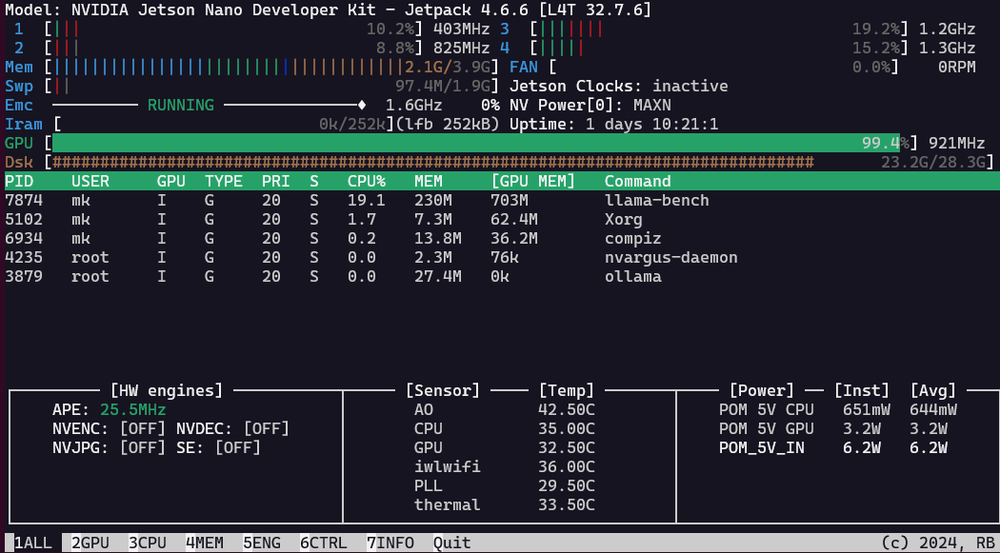
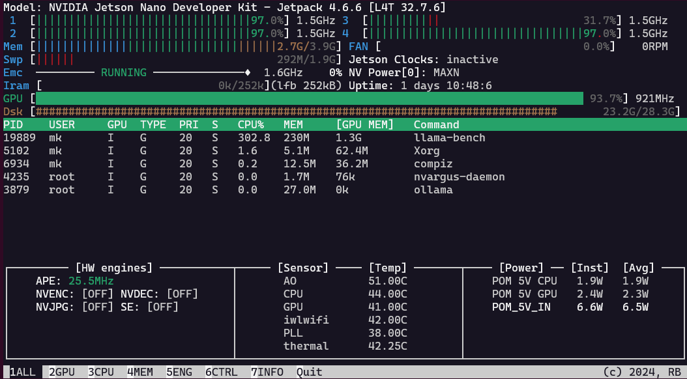

# Benchmarking llama.cpp with and without GPU/CUDA support

- CC:     gcc (GCC) 8.5.0
- CXX:    g++ (GCC) 8.5.0
- NVCC:   Build cuda_10.2_r440.TC440_70.29663091_0

### Versions of llama.cpp

- [81bc921](https://github.com/ggml-org/llama.cpp/tree/81bc9214a389362010f7a57f4cbc30e5f83a2d28) from December 7, 2023 - [b1618](https://github.com/ggml-org/llama.cpp/tree/b1618)
- [a33e6a0](https://github.com/ggml-org/llama.cpp/commit/a33e6a0d2a66104ea9a906bdbf8a94d050189d91) from February 26, 2024 - [b2275](https://github.com/ggml-org/llama.cpp/tree/b2275)
- [5d01670](https://github.com/ggml-org/llama.cpp/commit/5d01670266859444366e4f333ade5e0e5e2ae63d) from March 28, 2025 - [b4984](https://github.com/ggml-org/llama.cpp/tree/b4984)

### Versions of gcc

The [version history of gcc](https://gcc.gnu.org/releases.html) indicates:

- gcc 9.5 - May27, 2022
- gcc 9.4 - June 1, 2021 - from ppa:ubuntu-toolchain-r/test
- gcc 8.5 - May 14, 2021 - has to be compiled in 3 hours time
- gcc 8.4 - March 4, 2020 - from ppa:ubuntu-toolchain-r/test

### Sources

- 2025-03-26 [LLAMA.CPP on NVIDIA Jetson Nano: A Complete Guide](https://medium.com/@anuragdogra2192/llama-cpp-on-nvidia-jetson-nano-a-complete-guide-fb178530bc35), Running LLAMA.cpp on Jetson Nano 4 GB with CUDA 10.2 by Anurag Dogra on medium.com. His modifications compile an older version of llama.cpp with `gcc 8.5` successfully. Because the codebase for llama.cpp is rather old, the performance with GPU support is significantly worse than current versions running purely on the CPU. This motivated to get a more recent llama.cpp version to be compiled. He uses the version [81bc921](https://github.com/ggml-org/llama.cpp/tree/81bc9214a389362010f7a57f4cbc30e5f83a2d28) from December 7, 2023 - [b1618](https://github.com/ggml-org/llama.cpp/tree/b1618) of llama.cpp.
- 2025-01-13 Guide to compile a recent llama.cpp with CUDA support for the Nintendo Switch at [nocoffei.com](https://nocoffei.com/?p=352), titled "Switch AI ✨". The Nintendo Switch 1 has the same Tegra X1 CPU and Maxwell GPU as the Jetson Nano, but 256 CUDA cores instead of just 128, and a higher clock rate. This article was the main source for this gist.
- 2024-04-11 [Setup Guide for `llama.cpp` on Nvidia Jetson Nano 2GB](https://gist.github.com/FlorSanders/2cf043f7161f52aa4b18fb3a1ab6022f) by Flor Sanders in a gist. He describes the steps to install the `gcc 8.5` compiler on the Jetson. In step 5 he checks out the version [a33e6a0](https://github.com/ggml-org/llama.cpp/commit/a33e6a0d2a66104ea9a906bdbf8a94d050189d91) from February 26, 2024 - [b2275](https://github.com/ggml-org/llama.cpp/tree/b2275)
- 2024-05-04 [Add binary support for Nvidia Jetson Nano- JetPack 4 #4140](https://github.com/ollama/ollama/issues/4140) on issues for ollama. In his initial statement dtischler assumes llama.cpp would require gcc-11, but it actually compiles fine with gcc-8 in version 8.5 from 

## Speed with Gemma3:1b

First download with `./build/bin/llama-cli -hf unsloth/gemma-3-1b-it-GGUF:Q4_K_M`. The results:


## Speed with

This uses 

| version | ngl | pp512 | tg128 | release    | notes    |
|---------|-----|-------|-------|------------|----------|
| b4970   | 0   | 6.71  | 4.98  | 2025-03-28 | pure CPU |
| b1618   | 24  | 54.18 | 3.55  | 2023-12-07 | old!     |

The old GPU version is 8x at prompt processing, but only 71% at inference speed for token generation.

## CPU

Compiled with gcc 8.5.0 and the latest release of ggml-org/llama.cpp

```
| model                  |       size | params | backend | threads |  test |         t/s |
| ---------------------- | ---------: | -----: | ------- | ------: | ----: | ----------: |
| llama 1B Q4_K - Medium | 636.18 MiB | 1.10 B | CPU     |       4 | pp512 | 6.71 ± 0.00 |
| llama 1B Q4_K - Medium | 636.18 MiB | 1.10 B | CPU     |       4 | tg128 | 4.98 ± 0.01 |

build: c7b43ab6 (4970)
```


## GPU with 81bc921 from December 7, 2023 to llama.cpp3 - on [gist](https://gist.github.com/FlorSanders/2cf043f7161f52aa4b18fb3a1ab6022f?permalink_comment_id=5517046#gistcomment-5517046)

```
git clone https://github.com/ggml-org/llama.cpp.git llama.cpp3
cd llama.cpp3/
git checkout 81bc921
git checkout -b llamaForJetsonNano
mkdir build
cd build/
cmake .. -DLLAMA_CUBLAS=ON -DCMAKE_C_COMPILER=/usr/local/bin/gcc -DCMAKE_CXX_COMPILER=/usr/local/bin/g++
```

Results in

```
-- The C compiler identification is GNU 8.5.0
-- The CXX compiler identification is GNU 8.5.0
-- Detecting C compiler ABI info
-- Detecting C compiler ABI info - done
-- Check for working C compiler: /usr/local/bin/gcc - skipped
-- Detecting C compile features
-- Detecting C compile features - done
-- Detecting CXX compiler ABI info
-- Detecting CXX compiler ABI info - done
-- Check for working CXX compiler: /usr/local/bin/g++ - skipped
-- Detecting CXX compile features
-- Detecting CXX compile features - done
-- Found Git: /usr/bin/git (found version "2.17.1")
-- Performing Test CMAKE_HAVE_LIBC_PTHREAD
-- Performing Test CMAKE_HAVE_LIBC_PTHREAD - Failed
-- Check if compiler accepts -pthread
-- Check if compiler accepts -pthread - yes
-- Found Threads: TRUE
-- Found CUDAToolkit: /usr/local/cuda/targets/aarch64-linux/include (found version "10.2.300")
-- cuBLAS found
-- The CUDA compiler identification is NVIDIA 10.2.300 with host compiler GNU 8.5.0
-- Detecting CUDA compiler ABI info
-- Detecting CUDA compiler ABI info - done
-- Check for working CUDA compiler: /usr/local/cuda/bin/nvcc - skipped
-- Detecting CUDA compile features
-- Detecting CUDA compile features - done
-- Using CUDA architectures: 52;61;70
GNU ld (GNU Binutils for Ubuntu) 2.30
-- CMAKE_SYSTEM_PROCESSOR: aarch64
-- ARM detected
-- Performing Test COMPILER_SUPPORTS_FP16_FORMAT_I3E
-- Performing Test COMPILER_SUPPORTS_FP16_FORMAT_I3E - Failed
-- Configuring done (6.7s)
-- Generating done (0.4s)
-- Build files have been written to: /home/mk/llama.cpp3/build
```

### Edit the `ggml-cuda.cu` in the llama.cpp3 folder

``` sh
mk@jetson:~/llama.cpp3$ nano ggml-cuda.cu
mk@jetson:~/llama.cpp3$ cd build
mk@jetson:~/llama.cpp3/build$ make -j 2
[  1%] Generating build details from Git
[  2%] Building C object CMakeFiles/ggml.dir/ggml.c.o
-- Found Git: /usr/bin/git (found version "2.17.1")
[  3%] Building CXX object common/CMakeFiles/build_info.dir/build-info.cpp.o
[  3%] Built target build_info
[  4%] Building C object CMakeFiles/ggml.dir/ggml-alloc.c.o
[  5%] Building C object CMakeFiles/ggml.dir/ggml-backend.c.o
[  6%] Building C object CMakeFiles/ggml.dir/ggml-quants.c.o
[  2%] Built target build_info
[  3%] Building CUDA object CMakeFiles/ggml.dir/ggml-cuda.cu.o
[  7%] Built target ggml
[  9%] Building CXX object CMakeFiles/llama.dir/llama.cpp.o
[  9%] Linking CUDA static library libggml_static.a
[  9%] Built target ggml_static
[ 10%] Linking CXX static library libllama.a
[ 10%] Built target llama
[ 12%] Building C object tests/CMakeFiles/test-c.dir/test-c.c.o
[ 12%] Building CXX object common/CMakeFiles/common.dir/common.cpp.o
[ 13%] Linking CXX executable ../bin/test-c
[ 13%] Built target test-c
...
[ 96%] Built target llama-bench
[ 97%] Building CXX object examples/perplexity/CMakeFiles/perplexity.dir/perplexity.cpp.o
[ 98%] Linking CXX executable ../../bin/parallel
[ 98%] Built target parallel
[100%] Linking CXX executable ../../bin/perplexity
[100%] Built target perplexity
```

### Start the model

``` 
mk@jetson:~/llama.cpp3$ ./build/bin/main -m ../.cache/llama.cpp/TheBloke_TinyLlama-1.1B-Chat-v1.0-GGUF_tinyllama-1.1b-chat-v1.0.Q4_K_M.gguf -p "Solar System" --n-gpu-layers 5 --ctx-size 512 --threads 4 --temp 0.7 --top-k 40 --top-p 0.9 --batch-size 16
Log start
main: build = 1618 (81bc9214)
main: built with gcc (GCC) 8.5.0 for aarch64-unknown-linux-gnu
main: seed  = 1743168105
ggml_init_cublas: GGML_CUDA_FORCE_MMQ:   no
ggml_init_cublas: CUDA_USE_TENSOR_CORES: yes
ggml_init_cublas: found 1 CUDA devices:
  Device 0: NVIDIA Tegra X1, compute capability 5.3
llama_model_loader: loaded meta data with 23 key-value pairs and 201 tensors from ../.cache/llama.cpp/TheBloke_TinyLlama-1.1B-Chat-v1.0-GGUF_tinyllama-1.1b-chat-v1.0.Q4_K_M.gguf (version GGUF V3 (latest))
llm_load_tensors: ggml ctx size =    0,07 MiB
llm_load_tensors: using CUDA for GPU acceleration
llm_load_tensors: mem required  =  512,12 MiB
llm_load_tensors: offloading 5 repeating layers to GPU
llm_load_tensors: offloaded 5/25 layers to GPU
llm_load_tensors: VRAM used: 124,13 MiB
```

Speed:

```
llama_print_timings:        load time =    1502,98 ms
llama_print_timings:      sample time =     739,99 ms /   869 runs   (    0,85 ms per token,  1174,34 tokens per second)
llama_print_timings: prompt eval time =    1148,26 ms /     4 tokens (  287,06 ms per token,     3,48 tokens per second)
llama_print_timings:        eval time =  387189,88 ms /   868 runs   (  446,07 ms per token,     2,24 tokens per second)
llama_print_timings:       total time =  389600,15 ms
Log end
```

Now the CPU is only partly used with 650 mW, but the GPU is at 100% and 3.2W:



### Benchmarking

Start the benchmark without limiting to **just 5 layers**:

```
./build/bin/llama-bench -m ../.cache/llama.cpp/TheBloke_TinyLlama-1.1B-Chat-v1.0-GGUF_tinyllama-1.1b-chat-v1.0.Q4_K_M.gguf --n-gpu-layers 5
```

```
ggml_init_cublas: GGML_CUDA_FORCE_MMQ:   no
ggml_init_cublas: CUDA_USE_TENSOR_CORES: yes
ggml_init_cublas: found 1 CUDA devices:
  Device 0: NVIDIA Tegra X1, compute capability 5.3
| model                          |       size | params | backend | ngl | test   |          t/s |
| ------------------------------ | ---------: | -----: | ------- | --: | ------ | -----------: |
| llama ?B mostly Q4_K - Medium  | 636.18 MiB | 1.10 B | CUDA    |   5 | pp 512 | 20.99 ± 0.16 |
| llama ?B mostly Q4_K - Medium  | 636.18 MiB | 1.10 B | CUDA    |   5 | tg 128 |  2.77 ± 0.01 |

build: 81bc9214 (1618)
```

And now a limit to 10 layers:

| model                          |       size | params | backend | ngl | test   |          t/s |
| ------------------------------ | ---------: | -----: | ------- | --: | ------ | -----------: |
| llama ?B mostly Q4_K - Medium  | 636.18 MiB | 1.10 B | CUDA    |  10 | pp 512 | 24.29 ± 0.42 |
| llama ?B mostly Q4_K - Medium  | 636.18 MiB | 1.10 B | CUDA    |  10 | tg 128 |  2.93 ± 0.01 |

Now with 22 layers:

| model                          |       size |     params | backend    | ngl | test       |              t/s |
| ------------------------------ | ---------: | ---------: | ---------- | --: | ---------- | ---------------: |
| llama ?B mostly Q4_K - Medium  | 636.18 MiB |     1.10 B | CUDA       |  22 | pp 512     |     42.24 ± 0.63 |
| llama ?B mostly Q4_K - Medium  | 636.18 MiB |     1.10 B | CUDA       |  22 | tg 128     |      3.09 ± 0.01 |


And now with the maximum working number of layers, 24. With 25 or no limit it crashes:

| model                          |       size |     params | backend    | ngl | test       |              t/s |
| ------------------------------ | ---------: | ---------: | ---------- | --: | ---------- | ---------------: |
| llama ?B mostly Q4_K - Medium  | 636.18 MiB |     1.10 B | CUDA       |  24 | pp 512     |     54.18 ± 0.17 |
| llama ?B mostly Q4_K - Medium  | 636.18 MiB |     1.10 B | CUDA       |  24 | tg 128     |      3.55 ± 0.01 |

Now both the CPU at 1.9W and the GPU at 2.4W are at 100% and :



## GPU with a33e6a0 from February 26, 2024

```
git clone https://github.com/ggml-org/llama.cpp.git llama.cpp4
cd llama.cpp4/
git checkout a33e6a0
git checkout -b llamaForJetsonNano
```

### Edit the Makefile

```
diff --git a/Makefile b/Makefile
index 068f6ed0..a4ed3c95 100644
--- a/Makefile
+++ b/Makefile
@@ -106,11 +106,11 @@ MK_NVCCFLAGS = -std=c++11
 ifdef LLAMA_FAST
 MK_CFLAGS     += -Ofast
 HOST_CXXFLAGS += -Ofast
-MK_NVCCFLAGS  += -O3
+MK_NVCCFLAGS += -maxrregcount=80
 else
 MK_CFLAGS     += -O3
 MK_CXXFLAGS   += -O3
-MK_NVCCFLAGS  += -O3
+MK_NVCCFLAGS += -maxrregcount=80
 endif

 ifndef LLAMA_NO_CCACHE
@@ -299,7 +299,6 @@ ifneq ($(filter aarch64%,$(UNAME_M)),)
     # Raspberry Pi 3, 4, Zero 2 (64-bit)
     # Nvidia Jetson
     MK_CFLAGS   += -mcpu=native
-    MK_CXXFLAGS += -mcpu=native
     JETSON_RELEASE_INFO = $(shell jetson_release)
     ifdef JETSON_RELEASE_INFO
         ifneq ($(filter TX2%,$(JETSON_RELEASE_INFO)),)
```

**Manually:** (much easier with nano and CTRL+_)

- Change `MK_NVCCFLAGS += -O3` to `MK_NVCCFLAGS += -maxrregcount=80` on line 109 and line 113.
- Remove `MK_CXXFLAGS += -mcpu=native` on line 302.

**Build:**

```
make LLAMA_CUBLAS=1 CUDA_DOCKER_ARCH=sm_62 -j 6
```

```sh
mk@jetson:~/llama.cpp5$ make LLAMA_CUBLAS=1 CUDA_DOCKER_ARCH=sm_62 -j 6
I ccache not found. Consider installing it for faster compilation.
I llama.cpp build info:
I UNAME_S:   Linux
I UNAME_P:   aarch64
I UNAME_M:   aarch64
I CFLAGS:    -I. -Icommon -D_XOPEN_SOURCE=600 -D_GNU_SOURCE -DNDEBUG -DGGML_USE_CUBLAS -I/usr/local/cuda/include -I/opt/cuda/include -I/targets/x86_64-linux/include -I/usr/local/cuda/targets/aarch64-linux/include  -std=c11   -fPIC -O3 -Wall -Wextra -Wpedantic -Wcast-qual -Wno-unused-function -Wshadow -Wstrict-prototypes -Wpointer-arith -Wmissing-prototypes -Werror=implicit-int -Werror=implicit-function-declaration -pthread -mcpu=native -Wdouble-promotion
I CXXFLAGS:  -std=c++11 -fPIC -O3 -Wall -Wextra -Wpedantic -Wcast-qual -Wno-unused-function -Wmissing-declarations -Wmissing-noreturn -pthread   -Wno-array-bounds -Wno-format-truncation -Wextra-semi -I. -Icommon -D_XOPEN_SOURCE=600 -D_GNU_SOURCE -DNDEBUG -DGGML_USE_CUBLAS -I/usr/local/cuda/include -I/opt/cuda/include -I/targets/x86_64-linux/include -I/usr/local/cuda/targets/aarch64-linux/include
I NVCCFLAGS: -std=c++11 -maxrregcount=80 -use_fast_math --forward-unknown-to-host-compiler -Wno-deprecated-gpu-targets -arch=sm_62 -DGGML_CUDA_DMMV_X=32 -DGGML_CUDA_MMV_Y=1 -DK_QUANTS_PER_ITERATION=2 -DGGML_CUDA_PEER_MAX_BATCH_SIZE=128
I LDFLAGS:   -lcuda -lcublas -lculibos -lcudart -lcublasLt -lpthread -ldl -lrt -L/usr/local/cuda/lib64 -L/opt/cuda/lib64 -L/targets/x86_64-linux/lib -L/usr/local/cuda/targets/aarch64-linux/lib -L/usr/lib/wsl/lib
I CC:        gcc (GCC) 8.5.0
I CXX:       g++ (GCC) 8.5.0
I NVCC:      Build cuda_10.2_r440.TC440_70.29663091_0

/usr/local/bin/gcc  -I. -Icommon -D_XOPEN_SOURCE=600 -D_GNU_SOURCE -DNDEBUG -DGGML_USE_CUBLAS -I/usr/local/cuda/include
```

### Result - on [gist](https://gist.github.com/FlorSanders/2cf043f7161f52aa4b18fb3a1ab6022f?permalink_comment_id=5517121#gistcomment-5517121)

Update on this initial Gist [a33e6a0](https://github.com/ggml-org/llama.cpp/commit/a33e6a0d2a66104ea9a906bdbf8a94d050189d91) from February 26, 2024, I finally got it compiled! Somehow `cc` was still linked to cc (Ubuntu/Linaro 7.5.0-3ubuntu1~18.04) 7.5.0 for aarch64-linux-gnu. Updated /usr/bin/cc to gcc 8.5.0 and the single `make LLAMA_CUBLAS=1 CUDA_DOCKER_ARCH=sm_62 -j 6` runs through rather fast compared to the other CMake variants. `main` and `llama-bench` are not in a /build subfolder, but can be called. `main` works purely on the CPU with 4.24 prompt evaluation and 2.24 t/s evaluation or token generation to the `-p "Solar system"` prompt. 

But as soon as `--n-gpu-layers 1` is involved it crashes. And `llama-bench` crashes out of the box, even when no GPU layers are indicated. The initial statement is positiv:

```
Log start
main: build = 2275 (a33e6a0d)
main: built with gcc (GCC) 8.5.0 for aarch64-unknown-linux-gnu
main: seed  = 1743182462
ggml_init_cublas: GGML_CUDA_FORCE_MMQ:   no
ggml_init_cublas: CUDA_USE_TENSOR_CORES: yes
ggml_init_cublas: found 1 CUDA devices:
  Device 0: NVIDIA Tegra X1, compute capability 5.3, VMM: no
llama_model_loader: loaded meta data with 23 key-value pairs and 201 tensors from ..
...
llm_load_tensors: offloading 1 repeating layers to GPU
llm_load_tensors: offloaded 1/23 layers to GPU
llm_load_tensors:        CPU buffer size =   636,18 MiB
llm_load_tensors:      CUDA0 buffer size =    23,64 MiB
....................................................................................
llama_new_context_with_model: n_ctx      = 512
```

but then later

``` 
CUDA error: no kernel image is available for execution on the device
  current device: 0, in function ggml_cuda_op_flatten at ggml-cuda.cu:9906
  cudaGetLastError()
GGML_ASSERT: ggml-cuda.cu:255: !"CUDA error"
[New LWP 30420]
[Thread debugging using libthread_db enabled]
Using host libthread_db library "/lib/aarch64-linux-gnu/libthread_db.so.1".
0x0000007f8e76ed5c in __waitpid (pid=<optimized out>, stat_loc=0x0, options=<optimized out>) at ../sysdeps/unix/sysv/linux/waitpid.c:30
30      ../sysdeps/unix/sysv/linux/waitpid.c: No such file or directory.
#0  0x0000007f8e76ed5c in __waitpid (pid=<optimized out>, stat_loc=0x0, options=<optimized out>) at ../sysdeps/unix/sysv/linux/waitpid.c:30
30      in ../sysdeps/unix/sysv/linux/waitpid.c
#1  0x0000000000416370 in ggml_print_backtrace ()
#2  0x00000000004e6d50 in ggml_cuda_error(char const*, char const*, char const*, int, char const*) [clone .constprop.453] ()
#3  0x0000000000500138 in ggml_cuda_op_flatten(ggml_tensor const*, ggml_tensor const*, ggml_tensor*, void (*)(ggml_tensor const*, ggml_tensor const*, ggml_tensor*, float const*, float const*, float*, CUstream_st*)) ()
#4  0x00000000004fe2e8 in ggml_cuda_compute_forward ()
#5  0x00000000004fe928 in ggml_backend_cuda_graph_compute(ggml_backend*, ggml_cgraph*) ()
#6  0x000000000050b214 in ggml_backend_sched_graph_compute ()
#7  0x000000000046a920 in llama_decode_internal(llama_context&, llama_batch) ()
#8  0x000000000046b730 in llama_decode ()
#9  0x00000000004b414c in llama_init_from_gpt_params(gpt_params&) ()
#10 0x000000000040f94c in main ()
[Inferior 1 (process 30419) detached]
Aborted (core dumped)
```

Same result for `llama-bench` after a promising

```
ggml_init_cublas: GGML_CUDA_FORCE_MMQ:   no
ggml_init_cublas: CUDA_USE_TENSOR_CORES: yes
ggml_init_cublas: found 1 CUDA devices:
  Device 0: NVIDIA Tegra X1, compute capability 5.3, VMM: no
| model                          |       size |     params | backend    | ngl | test       |              t/s |
| ------------------------------ | ---------: | ---------: | ---------- | --: | ---------- | ---------------: |
CUDA error: no kernel image is available for execution on the device
```
But at least for a short period of time the GPU is actually utilized:


from
```
llm_load_tensors: offloading 22 repeating layers to GPU
llm_load_tensors: offloading non-repeating layers to GPU
llm_load_tensors: offloaded 23/23 layers to GPU
llm_load_tensors:        CPU buffer size =    35,16 MiB
llm_load_tensors:      CUDA0 buffer size =   601,02 MiB
```
