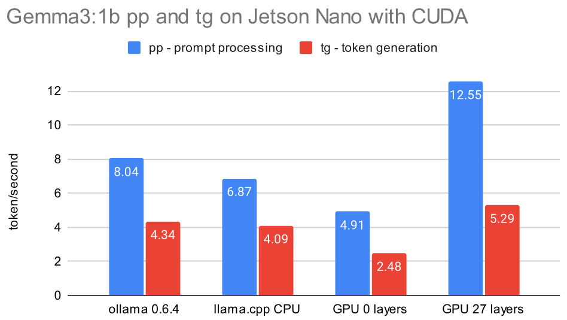

# Setup Guide for `llama.cpp` with CUDA on Nvidia Jetson Nano 4GB

As of April 2025 the current version of llama.cpp can be compiled for the Jetson Nano from 2019 with GPU/CUDA support using `gcc 8.5` and `nvcc 10.2`. A few variants are described here by their build date, and later compared by their performance in benchmarks:

- 2025-04-04 **b5050** Some extra steps had to be included to handle the new support of `bfloat16` in llama.cpp since January 2025. Procedure is described in [this gist](https://github.com/ggml-org/llama.cpp/releases/tag/b4400).
- 2024-12-31 [b4400](https://github.com/ggml-org/llama.cpp/releases/tag/b4400) Following the steps from the [gist](https://github.com/ggml-org/llama.cpp/releases/tag/b4400) above, step 6 can be ommited. Source: a [build for the Nintendo Switch](https://nocoffei.com/?p=352)!
- 2024-02-26 [b2275](https://github.com/ggml-org/llama.cpp/tree/b2275) A [gist by Flor Sanders](https://gist.github.com/FlorSanders/2cf043f7161f52aa4b18fb3a1ab6022f) from 2024-04-11 describes the procedure to combile a version with GPU acceleration.
- 2023-12-07 [b1618](https://github.com/ggml-org/llama.cpp/tree/b1618) A medium.com article from Anurag Dogra from 2025-03-26 describes the modification needed to compile llama.cpp with `gcc 8.5` and CUDA support.

## Structure

- [Prerequisites](https://github.com/kreier/jetson/tree/main/llama.cpp#prerequisites)
- [Procedure](https://github.com/kreier/jetson/tree/main/llama.cpp#procedure)
- [Benchmark](https://github.com/kreier/jetson/tree/main/llama.cpp#benchmark)
- [Compile llama.cpp for CPU mode](https://github.com/kreier/jetson/tree/main/llama.cpp#compile-llamacpp-for-cpu-mode) - 24 minutes
- [Install prerequisites](https://github.com/kreier/jetson/tree/main/llama.cpp#install-prerequisites)
- [Choosing the right compiler](https://github.com/kreier/jetson/tree/main/llama.cpp#choosing-the-right-compiler)
- [Sources](https://github.com/kreier/jetson/tree/main/llama.cpp#sources)

And the Jetson Nano indeed uses its GPU to generate tokens with 100% and 4 Watt, while the CPU is only used in the 10% range with 0.7 Watt. If it is faster than the pure CPU use with ollama or a CPU build - see the benchmark section!

<><>

<!--

-->

## Prerequisites

You will need the following software packages installed. The section "[Install prerequisites](https://gist.github.com/kreier/6871691130ec3ab907dd2815f9313c5d#install-prerequisites)" describes the process in detail. The installation of `gcc 8.5` and `cmake 3.31` of these might take several hours.

- Nvidia CUDA Compiler nvcc 10.2 - `nvcc --version`
- GCC and CXX (g++) 8.5 - `gcc --version`
- cmake >= 3.14 - `cmake --version`
- `nano`, `curl`, `libcurl4-openssl-dev`, `python3-pip` and `jtop`

## Procedure

To ensure this gist keeps working in the future, while newer versions of llama.cpp are released, we will check out a specific version (b5050) known to be working. To try a more recent version remove the steps `git checkout 3f9da22` and `git checkout -b llamaJetsonNanoCUDA` in the following instructions:

### 1. Clone repository

``` sh
git clone https://github.com/ggml-org/llama.cpp llama5050gpu.cpp
cd llama5050gpu.cpp
git checkout 3f9da22
git checkout -b llamaJetsonNanoCUDA
```

Now we have to make changes to these 6 files before calling `cmake` to start compiling:

- CMakeLists.txt 14
- ggml/CMakeLists.txt 274
- ggml/src/ggml-cuda/common.cuh 455
- ggml/src/ggml-cuda/fattn-common.cuh 623
- ggml/src/ggml-cuda/fattn-vec-f32.cuh 71
- ggml/src/ggml-cuda/template-instances/../fattn-vec-f16.cuh 73

Early 2025 llama.cpp started supporting and using `bfloat16`, a feature not included in nvcc 10.2. We have two options:

- Option A: Create two new files
    - /usr/local/cuda/include/cuda_bf16.h
    - /usr/local/cuda/include/cuda_bf16.hpp
- Option B: Edit 3 files
    - ggml/src/ggml-cuda/vendors/cuda.h
    - ggml/src/ggml-cuda/convert.cu
    - ggml/src/ggml-cuda/mmv.cu

Details for each option are described below in step 2 to 7:

### 2. Add a limit to the CUDA architecture in `CMakeLists.txt`

Edit the file *CMakeLists.txt* with `nano CMakeLists.txt`. Add the following 3 lines after line 14 (with Ctrl + "\_"):

```
if(NOT DEFINED ${CMAKE_CUDA_ARCHITECTURES})
    set(CMAKE_CUDA_ARCHITECTURES 50 61)
endif()
```


### 3. Add two linker instructions after line 274 in `ggml/CMakeLists.txt`

Edit the file with `nano ggml/CMakeLists.txt` and enter two new lines after `set_target_properties(ggml PROPERTIES PUBLIC_HEADER "${GGML_PUBLIC_HEADERS}")` and before `#if (GGML_METAL)`. It should then look like:

``` h
set_target_properties(ggml PROPERTIES PUBLIC_HEADER "${GGML_PUBLIC_HEADERS}")
target_link_libraries(ggml PRIVATE stdc++fs)
add_link_options(-Wl,--copy-dt-needed-entries)
#if (GGML_METAL)
#    set_target_properties(ggml PROPERTIES RESOURCE "${CMAKE_CURRENT_SOURCE_DIR}/src/ggml-metal.metal")
#endif()
```

With `target_link_libraries(ggml PRIVATE stdc++fs)` and `add_link_options(-Wl,--copy-dt-needed-entries)` we avoid some static link issues that don't appear in later gcc versions. See [nocoffei's comment](https://nocoffei.com/?p=352).


### 4. Remove *cpmstexpr* from line 455 in `ggml/src/ggml-cuda/common.cuh`

This feature from CUDA C++ 17 we don't support anyway, just remove the **constexpr** after the *static* in line 455.1 Use `nano ggml/src/ggml-cuda/common.cuh`. After that it looks like:

``` h
// TODO: move to ggml-common.h
static __device__ int8_t kvalues_iq4nl[16] = {-127, -104, -83, -65, -49, -35, -22, -10, 1, 13, 25, 38, 53, 69, 89, 113};
```

### 5. Comment lines containing *__buildin_assume* with // 

This avoids the compiler error *"__builtin_assume" is undefined* for these three files:

- line 623, `nano ggml/src/ggml-cuda/fattn-common.cuh` - 532
- line 71, `nano ggml/src/ggml-cuda/fattn-vec-f32.cuh` - 70
- line 73, `nano ggml/src/ggml-cuda/template-instances/../fattn-vec-f16.cuh`

If you have a version lower than 4400 you can skip the next step.

In January 2025 with version larter than b4400 llama.cpp started including support for bfloat16. There is a standard library `cuda_bf16.h` in the folder `/usr/local/cuda-10.2/targets/aarch64-linux/include` for nvcc 11.0 and larger. With more than 5000 lines one can not simply copy a later version this file into this folder (with its companion `cuda_bf16.hpp` and 3800 lines) and hope it would work. Since it is linked to version 11 or 12, the error messages keep expanding (e.g. `/usr/local/cuda/include/cuda_bf16.h:4322:10: fatal error: nv/target: No such file or directory`). We have two working options

### 6. Option A: Create a `cuda_bf16.h` that redefines `nv_bfloat16` as `half`

Create two new files in the folder `/usr/local/cuda/include/`. The first one is `cuda_bf16.h`, give it the following content:

``` h
#ifndef CUDA_BF16_H
#define CUDA_BF16_H

#include <cuda_fp16.h>

// Define nv_bfloat16 as half
typedef half nv_bfloat16;

#endif // CUDA_BF16_H
```

The second file is `cuda_bf16.hpp` with the content

``` hpp
#ifndef CUDA_BF16_HPP
#define CUDA_BF16_HPP

#include "cuda_bf16.h"

namespace cuda {

    class BFloat16 {
    public:
        nv_bfloat16 value;

        __host__ __device__ BFloat16() : value(0) {}
        __host__ __device__ BFloat16(float f) { value = __float2half(f); }
        __host__ __device__ operator float() const { return __half2float(value); }
    };

} // namespace cuda

#endif // CUDA_BF16_HPP
```

Both files should be made executeable? Try `sudo chmod a+x /usr/local/cuda/include/cuda_bf16.h` and `sudo chmod a+x /usr/local/cuda/include/cuda_bf16.hpp`.


### 6. Option B: Comment all code related to `nv_float16` (*bfloat16`) in 3 files

The second solution is to remove all references of `nv_float16` in the 3 files referencing them. First we have to __NOT__ include the nonexisting `cuda_bf16.h`. Just add two // in front of line 6 with `nano ggml/src/ggml-cuda/vendors/cuda.h`. After that it looks like this:

``` h
#include <cuda.h>
#include <cublas_v2.h>
//#include <cuda_bf16.h>
#include <cuda_fp16.h>
```

That is not enough, the new data type `nv_bfloat16` is referenced 8 times in 2 files. Replace each instance of them with `half`

- 684 in `ggml/src/ggml-cuda/convert.cu`
- 60 in `ggml/src/ggml-cuda/mmv.cu`
- 67 in `ggml/src/ggml-cuda/mmv.cu`
- 68 in `ggml/src/ggml-cuda/mmv.cu`
- 235 in `ggml/src/ggml-cuda/mmv.cu` (2x)
- 282 in `ggml/src/ggml-cuda/mmv.cu` (2x)

**DONE!** Now all you have to do is create the build folder with specific instructions, and then wait until the second step is completed to build the release.


### 7. Add a flags to `cmake -B build` to avoid the CUDA17 errors

You will see a few warnings, though. But no error like `Target "ggml-cuda" requires the language dialect "CUDA17" (with compiler extensions).` that would stop the compilation. The first command has a few more flags:

``` sh
cmake -B build -DGGML_CUDA=ON -DLLAMA_CURL=ON -DCMAKE_CUDA_STANDARD=14 -DCMAKE_CUDA_STANDARD_REQUIRED=true -DGGML_CPU_ARM_ARCH=armv8-a -DGGML_NATIVE=off
```

Finally the last step, that will take us 2 hours:

``` sh
cmake --build build --config Release
```

After that you can start your conversation with

``` sh
build/bin/llama-cli -hf ggml-org/gemma-3-1b-it-GGUF --n-gpu-layers 99
```


## Benchmark

We use the same Jetson Nano machine from 2019, no overclocking settings. The test prompt for `llama-cli`, `ollama` and the older `main` is "Explain quantum entanglement". Tests include the latest ollama 0.6.4 from April 2025 in CPU mode and several versions of llama.cpp compiled in pure CPU mode and with GPU support, using different amounts of layers offloaded to the GPU. The two LLM models considerd in the benchmarks are:

- 2023-12-31 [TinyLlama-1.1B-Chat Q4 K M](https://huggingface.co/TheBloke/TinyLlama-1.1B-Chat-v1.0-GGUF?show_file_info=tinyllama-1.1b-chat-v1.0.Q4_K_M.gguf) with 669 MB, 22 layers, 1.1 billion parameters and 2048 context length
- 2025-03-12 [Gemma3:1b Q4 K M](https://huggingface.co/ggml-org/gemma-3-1b-it-GGUF?local-app=llama.cpp) with 806 MB, 27 layers, 1 billion parameters and 32768 context length

### TinyLlama-1.1B-Chat 2023-12-31

Here is the prompt for b1618 and b2275, while b440 and b5050 use the second `ollama-cli` call, and we put the prompt in the cli after the startup.

```
./main -hf TheBloke/TinyLlama-1.1B-Chat-v1.0-GGUF --n-gpu-layers 25 -p "Explain quantum entanglement"
./build/bin/llama-cli -hf TheBloke/TinyLlama-1.1B-Chat-v1.0-GGUF --n-gpu-layers 25
```


llama.cpp has also a build-in benchmark program, here tested with the CUDA version b1618 from December 2023:

| ngl | pp512 | tg128 |
|-----|-------|-------|
| 0   | 17.80 | 2.59  |
| 5   | 20.57 | 3.00  |
| 10  | 24.09 | 2.83  |
| 15  | 31.69 | 3.39  |
| 20  | 39.35 | 3.54  |
| 24  | 55.52 | 3.68  |

Using just the CPU version with a newer llama.cpp b5017 from April 2025 we get a much faster token generation just with the CPU

| ngl | pp512 | tg128 |
|-----|-------|-------|
| 0   |  6.73 | 5.18  |

### Gemma3:1b 2025-03-12

This much more recent [model from March 2025](https://huggingface.co/ggml-org/gemma-3-1b-it-GGUF?local-app=llama.cpp) is slightly larger with 806 MB but much more capable than TinyLlama, and comparable in speed. The prompt is "Explain quantum entanglement"

``` sh
llama-cli -hf ggml-org/gemma-3-1b-it-GGUF --n-gpu-layers 99
llama-cli -hf unsloth/gemma-3-1b-it-GGUF:Q4_K_M
./build/bin/llama-bench -m ../.cache/llama.cpp/ggml-org_gemma-3-1b-it-GGUF_gemma-3-1b-it-Q4_K_M.gguf --n-gpu-layers 0
```

Result:

``` sh
ggml_cuda_init: found 1 CUDA devices:
  Device 0: NVIDIA Tegra X1, compute capability 5.3, VMM: no
| model                   |       size |   params | backend | ngl |  test |           t/s |
| ----------------------- | ---------: | -------: | ------- | --: | ----: | ------------: |
| gemma3 1B Q4_K - Medium | 762.49 MiB | 999.89 M | CUDA    |  25 | pp512 | 115.05 ± 0.08 |
| gemma3 1B Q4_K - Medium | 762.49 MiB | 999.89 M | CUDA    |  25 | tg128 |   5.03 ± 0.01 |

build: 193c3e03 (5038)
```



While a compiled CPU version of llama.cpp is comparable in speed with a recent ollama version, so might a GPU version be slower when not offloading layers to the GPU, but be **20% faster** if the model is offloaded to the GPU!

## Compile llama.cpp for CPU mode

This can be done with `gcc 8.5` or `gcc 9.4` in 24 minutes and was tested with a version as recent as April 2025. You can follow the [instructions from llama.cpp](https://github.com/ggml-org/llama.cpp/blob/master/docs/build.md). We added the parameter `-DLLAMA_CURL=ON` to support an easy model download from huggingface with the `-hf` command:

``` sh
git clone https://github.com/ggml-org/llama.cpp
cd llama.cpp
cmake -B build -DLLAMA_CURL=ON
cmake --build build --config Release
```

After finishing the compilation its time for the first model and AI chat:

```
./build/bin/llama-cli -hf ggml-org/gemma-3-1b-it-GGUF
```


## Install prerequisites


- JetPack 4.6.6 (L4T 32.7.6-20241104234540) - `dpkg-query --show nvidia-l4t-core`

Most of the prerequisites can be installed rather fast. But compiling gcc 8.5.0 will take 3 hours on the Jetson Nano. And the installation of cmake 3.31.5 will also take 45 minutes.

``` sh
sudo apt update
sudo apt install nano curl libcurl4-openssl-dev python3-pip
pip3 install jetson-top
```

### Install `cmake >= 3.14`

Purge any old `cmake` installation and install a newer `3.27`

``` sh
sudo apt-get remove --purge cmake
sudo apt-get isntall libssl-dev
wget https://cmake.org/files/v3.27/cmake-3.27.1.tar.gz
tar -xzvf cmake-3.27.1.tar.gz
cd cmake-3.27.1.tar.gz
./bootstrap
make -j4
sudo make install
```


## Choosing the right compiler

### GCC 9.4

This compiler from June 1, 2021 can be easily installed from an apt repository in a few minutes, using

``` sh
sudo apt install build-essential software-properties-common manpages-dev -y
sudo add-apt-repository ppa:ubuntu-toolchain-r/test -y
sudo apt update
sudo apt install gcc-9 g++-9 -y
sudo update-alternatives --install /usr/bin/gcc gcc /usr/bin/gcc-9 9
sudo update-alternatives --install /usr/bin/g++ g++ /usr/bin/g++-9 9
```

But it is not compatible with `nvcc 10.2` and shows `error: #error -- unsupported GNU version! gcc versions later than 8 are not supported!`. The reasons are found in line 136 of 

> /usr/local/cuda/targets/aarch64-linux/include/crt/host_config.h

``` h
#if defined (__GNUC__)
#if __GNUC__ > 8
#error -- unsupported GNU version! gcc versions later than 8 are not supported!
#endif /* __GNUC__ > 8 */ 
```

### GCC 8.4

This compiler version 8.4 from March 4, 2020 can be installed in the same fast fashion as the mentioned 9.4 above. Just replace three lines:

``` sh
sudo apt install gcc-8 g++-8 -y
sudo update-alternatives --install /usr/bin/gcc gcc /usr/bin/gcc-8 8
sudo update-alternatives --install /usr/bin/g++ g++ /usr/bin/g++-8 8
```

But it throws an error on `llama.cpp/ggml-quants.c` line 407 with:

``` sh
~/llama.cpp/ggml-quants.c: In function ‘ggml_vec_dot_q3_K_q8_K’:
~/llama.cpp/ggml-quants.c:407:27: error: implicit declaration of function ‘vld1q_s8_x4’; did you mean ‘vld1q_s8_x’? [-Werror=implicit-function-declaration]
 #define ggml_vld1q_s8_x4  vld1q_s8_x4
```

It seems that in version 8.4 the ARM NEON intrinsic `vld1q_s8_x4` is treated as a built-in function that cannot be replaced by a macro. It might be related to a fix from [ktkachov on 2020-10-13](https://gcc.gnu.org/bugzilla/show_bug.cgi?id=97349) as one of the [199 bug fixes](https://gcc.gnu.org/bugzilla/buglist.cgi?bug_status=RESOLVED&resolution=FIXED&target_milestone=8.5) leading to 8.5. Let's use the next version:

### GCC 8.5

This version was released May 14, 2021. Unfortunately this version is not yet available for ubuntu 18.04 on `ppa:ubuntu-toolchain-r/test`. We have to compile it by ourselves, and this takes some 3 hours (for the `make -j$(nproc)` step). The steps are:

``` sh
sudo apt-get install -y build-essential software-properties-common
sudo apt-get install -y libgmp-dev libmpfr-dev libmpc-dev
wget http://ftp.gnu.org/gnu/gcc/gcc-8.5.0/gcc-8.5.0.tar.gz
tar -xvzf gcc-8.5.0.tar.gz
cd gcc-8.5.0
./contrib/download_prerequisites
mkdir build && cd build
../configure --enable-languages=c,c++ --disable-multilib
make -j$(nproc)  # Use all CPU cores
sudo make install
sudo update-alternatives --install /usr/bin/gcc gcc /usr/local/bin/gcc 100
sudo update-alternatives --install /usr/bin/g++ g++ /usr/local/bin/g++ 100
```

## Sources

- 2025-03-26 [LLAMA.CPP on NVIDIA Jetson Nano: A Complete Guide](https://medium.com/@anuragdogra2192/llama-cpp-on-nvidia-jetson-nano-a-complete-guide-fb178530bc35), Running LLAMA.cpp on Jetson Nano 4 GB with CUDA 10.2 by Anurag Dogra on medium.com. His modifications compile an older version of llama.cpp with `gcc 8.5` successfully. Because the codebase for llama.cpp is rather old, the performance with GPU support is significantly worse than current versions running purely on the CPU. This motivated to get a more recent llama.cpp version to be compiled. He uses the version [81bc921](https://github.com/ggml-org/llama.cpp/tree/81bc9214a389362010f7a57f4cbc30e5f83a2d28) from December 7, 2023 - [b1618](https://github.com/ggml-org/llama.cpp/tree/b1618) of llama.cpp.
- 2025-01-13 Guide to compile a recent llama.cpp with CUDA support for the Nintendo Switch at [nocoffei.com](https://nocoffei.com/?p=352), titled "Switch AI ✨". The Nintendo Switch 1 has the same Tegra X1 CPU and Maxwell GPU as the Jetson Nano, but 256 CUDA cores instead of just 128, and a higher clock rate. This article was the main source for this gist.
- 2024-04-11 [Setup Guide for `llama.cpp` on Nvidia Jetson Nano 2GB](https://gist.github.com/FlorSanders/2cf043f7161f52aa4b18fb3a1ab6022f) by Flor Sanders in a gist. He describes the steps to install the `gcc 8.5` compiler on the Jetson. In step 5 he checks out the version [a33e6a0](https://github.com/ggml-org/llama.cpp/commit/a33e6a0d2a66104ea9a906bdbf8a94d050189d91) from February 26, 2024 - [b2275](https://github.com/ggml-org/llama.cpp/tree/b2275)
- 2024-05-04 [Add binary support for Nvidia Jetson Nano- JetPack 4 #4140](https://github.com/ollama/ollama/issues/4140) on issues for ollama. In his initial statement dtischler assumes llama.cpp would require gcc-11, but it actually compiles fine with gcc-8 in version 8.5 from May 14, 2021 as shown in [this gist](https://gist.github.com/kreier/6871691130ec3ab907dd2815f9313c5d).
